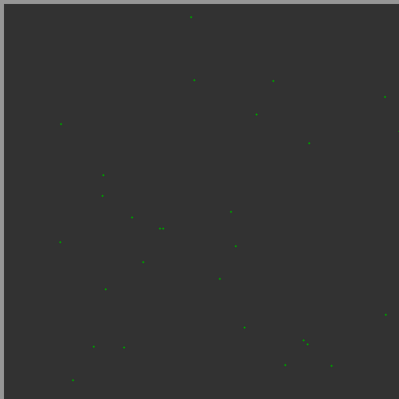
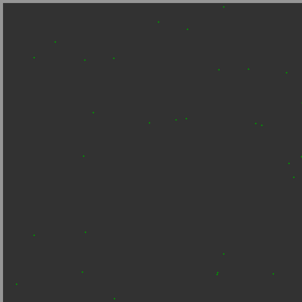
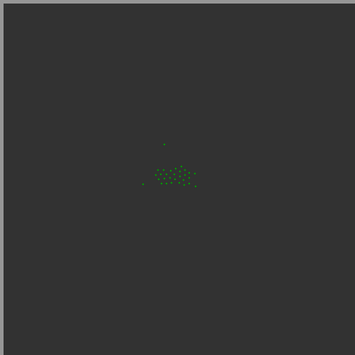
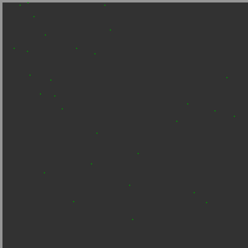
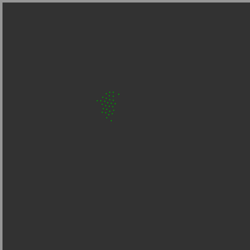

Rodando os testes para obter valores de cada roda:

## Utilização do algoritmo genético

Para o algorítimo genérico foi utilzado a segunda configuração

- População: 30

- Função objetivo sendo a velocidade de cada roda (R1, R2)

- Objetivo, minimizar a função fetness

### Função objetivo

Para a função objetivo é considerado duas otimizações com pesos diferentes na função, são elas:

1 - Minimizar o diametro do menor circulo que englobe todos os robos (90%)

2 - Minimizar o tempo até estabilizar o agrupamento (%10)

```txt
step	cost_avg	cost_best	lowVelocity	highVelocity
Generation [0], Best=1471, Average=1944.23, Best genes=({8,9}), Exe_time=165.079
Generation [1], Best=1352, Average=1949.53, Best genes=({8,9}), Exe_time=73.694
Generation [2], Best=1285, Average=1844.47, Best genes=({8,9}), Exe_time=57.8689
Generation [3], Best=1285, Average=1873.53, Best genes=({8,9}), Exe_time=84.3323
Generation [4], Best=1168, Average=1872.53, Best genes=({8,9}), Exe_time=88.4354
Generation [5], Best=1168, Average=1672.8, Best genes=({8,9}), Exe_time=110.31
Generation [6], Best=1168, Average=1666.63, Best genes=({8,9}), Exe_time=85.7134s
Generation [7], Best=1168, Average=1728.4, Best genes=({8,9}), Exe_time=101.145
Generation [8], Best=1166, Average=1681.07, Best genes=({8,9}), Exe_time=95.3635
Generation [9], Best=1166, Average=1718.43, Best genes=({8,9}), Exe_time=115.915
Generation [10], Best=1166, Average=1712.2, Best genes=({8,9}), Exe_time=100.235
Generation [11], Best=1166, Average=1485.47, Best genes=({8,9}), Exe_time=96.9136
Generation [12], Best=1166, Average=1524.83, Best genes=({8,9}), Exe_time=72.4187
Generation [13], Best=1166, Average=1577.67, Best genes=({8,9}), Exe_time=134.442
Generation [14], Best=1166, Average=1516.8, Best genes=({8,9}), Exe_time=102.973
Generation [15], Best=1166, Average=1466.27, Best genes=({8,9}), Exe_time=94.4294
Generation [16], Best=1166, Average=1452.5, Best genes=({8,9}), Exe_time=122.967
Generation [17], Best=1166, Average=1453.9, Best genes=({8,9}), Exe_time=96.8053
Generation [18], Best=1166, Average=1430.67, Best genes=({8,9}), Exe_time=82.9258
Generation [19], Best=1166, Average=1399.1, Best genes=({8,9}), Exe_time=94.4317
Generation [20], Best=1166, Average=1510.63, Best genes=({8,9}), Exe_time=94.2199
Generation [21], Best=1166, Average=1510.4, Best genes=({8,9}), Exe_time=91.197
Generation [22], Best=1166, Average=1457.13, Best genes=({8,9}), Exe_time=94.912
Generation [23], Best=1166, Average=1347.77, Best genes=({8,9}), Exe_time=105.505
Generation [24], Best=1166, Average=1335.33, Best genes=({8,9}), Exe_time=125.354
Generation [25], Best=1166, Average=1288.23, Best genes=({8,9}), Exe_time=102.655
Generation [26], Best=1166, Average=1265.57, Best genes=({8,9}), Exe_time=127.111
Generation [27], Best=1166, Average=1264.27, Best genes=({8,9}), Exe_time=125.5
Generation [28], Best=1166, Average=1264.27, Best genes=({8,9}), Exe_time=122.515
```

## Exemplos da primeira geração

### Primeira execução

- Inicial:



- Final:


### Segunda execução

- Inicial:



- Final:



### Terceira execução

- Inicial:



- Final:


